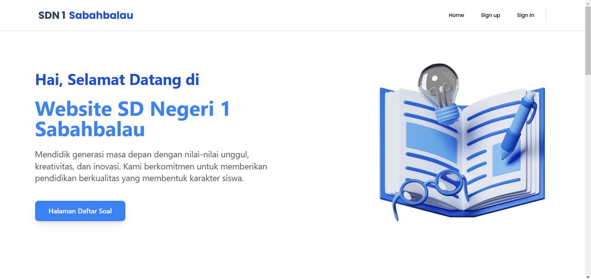
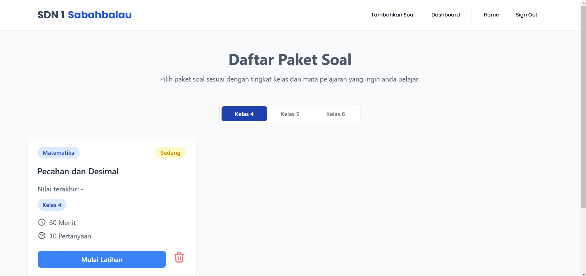
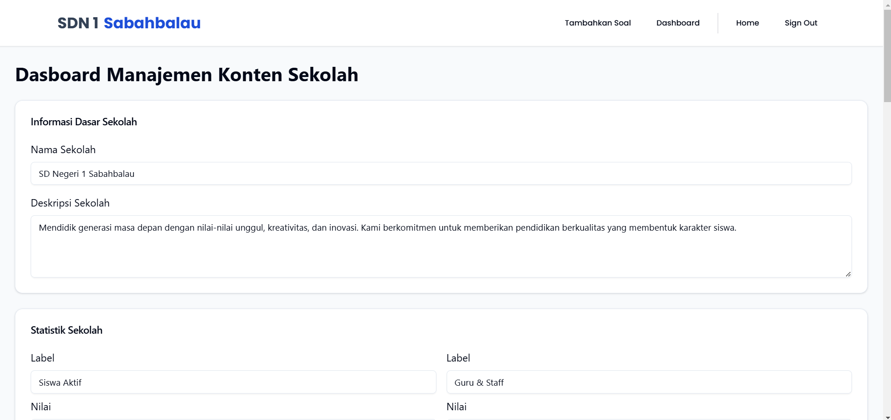

# 🏫 Website SDN 1 Sabahbalau

Selamat datang di repositori **Website SDN 1 Sabahbalau**! 🎉  
Proyek ini bertujuan untuk memberikan solusi digital yang modern dan interaktif bagi SDN 1 Sabahbalau, meliputi berbagai informasi sekolah serta fitur latihan soal yang dapat diakses oleh siswa kelas 4, 5, dan 6. Website ini dikembangkan menggunakan **Next.js**, **React.js**, **Tailwind CSS**, dan **MongoDB** sebagai database.

## 🚀 Teknologi yang Digunakan

- **Next.js**: Framework React untuk pengembangan aplikasi web yang cepat dan skalabel.
- **React.js**: Library JavaScript untuk membangun antarmuka pengguna yang dinamis.
- **Tailwind CSS**: Framework CSS yang membantu dalam pembuatan desain responsif dan cepat.
- **MongoDB**: Database NoSQL untuk menyimpan data sekolah, soal latihan, dan informasi pengguna.
- **Kinde**: Sistem autentikasi yang aman untuk login dan registrasi pengguna.

## ✨ Fitur Utama

### 🎓 Fitur untuk Pengguna (Siswa dan Orang Tua)
- **Informasi Sekolah**: Menampilkan profil sekolah, visi & misi, fasilitas, berita terkini, dan pengumuman.
- **Latihan Soal Kelas 4, 5, dan 6**: Paket latihan soal untuk siswa kelas 4, 5, dan 6 dengan berbagai tipe soal interaktif.
- **Hasil Latihan Soal**: Menyimpan dan menampilkan skor hasil latihan soal untuk evaluasi siswa.

### 👨‍🏫 Fitur Admin (Guru dan Staf)
- **Manajemen Konten Sekolah**: Admin dapat mengubah profil sekolah, menambah berita, dan memperbarui pengumuman.
- **Manajemen Soal Latihan**: Guru dapat menambahkan paket soal, mengedit, dan menghapus soal latihan untuk siswa.
- **Dashboard Admin**: Antarmuka yang mudah digunakan untuk mengelola konten website.

### 🔐 Sistem Autentikasi
Website ini menggunakan sistem autentikasi dari **Kinde** yang aman dan mudah digunakan, mendukung login dan registrasi pengguna, termasuk siswa dan admin. Dengan sistem ini, pengguna dapat mengakses fitur yang sesuai dengan peran mereka (siswa atau admin).

## 📸 Tampilan Website

| Halaman Utama | Halaman Latihan Soal | Dashboard Admin |
| ------------- | -------------------- | --------------- |
|  |  |  |

## 🛠️ Fitur yang Akan Datang

- **Fitur Forum Diskusi**: Siswa dapat bertanya dan berdiskusi tentang latihan soal.
- **Notifikasi Real-Time**: Memberikan notifikasi kepada siswa mengenai pengumuman baru atau soal latihan yang tersedia.
- **Analitik Performa Siswa**: Menambahkan fitur analitik untuk membantu guru melihat kemajuan belajar siswa.

## 🤝 Kontribusi

Kami terbuka untuk kontribusi!  
Jika Anda ingin berkontribusi, silakan fork repositori ini, buat branch baru, dan buat pull request.  
Kami akan meninjau perubahan Anda sesegera mungkin.

## 📄 Lisensi

Proyek ini dilisensikan di bawah [MIT License](./LICENSE).

## 📞 Kontak

Jika Anda memiliki pertanyaan atau masukan mengenai proyek ini, silakan hubungi kami di:

Instagram: @m.raihanathalah

Email: rehan121203@gmail.com
<!-- - **Email**: sdn1sabahbalau@example.com -->
<!-- - **Website**: [https://sdn1sabahbalau.example.com](https://sdn1sabahbalau.example.com) -->

---

Terima kasih telah mengunjungi proyek ini! Semoga website ini dapat membantu memajukan pendidikan di SDN 1 Sabahbalau. 🚀
